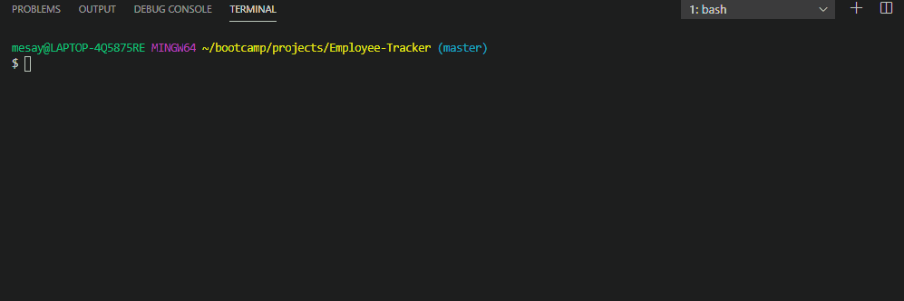

# Employee Tracker

 Solution for managing a company's employees

## Installation

clone project to local machine and install all required node modules

## Usage

```bash
use 'node employee_db.js' to start using the app
```



## Tools Used 
 - node, 
 - inquirer, and
 - MySQL.

